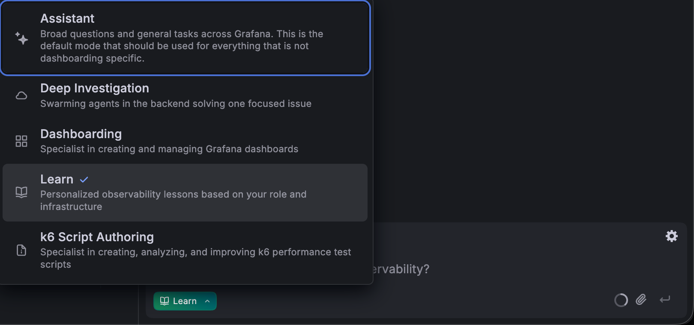
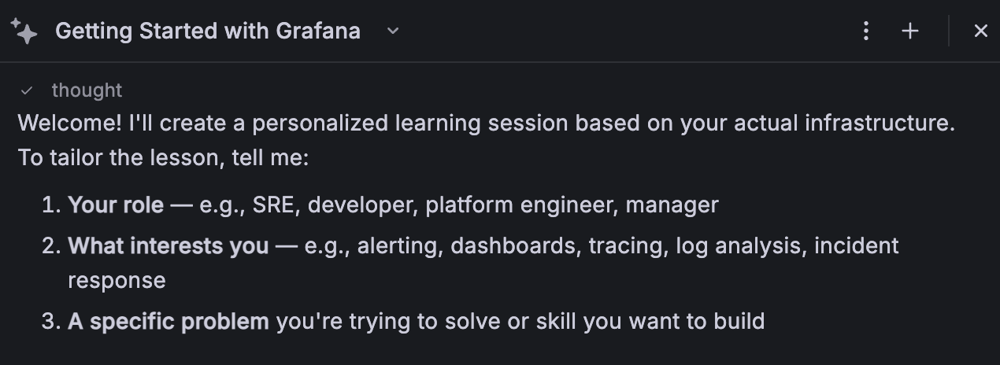
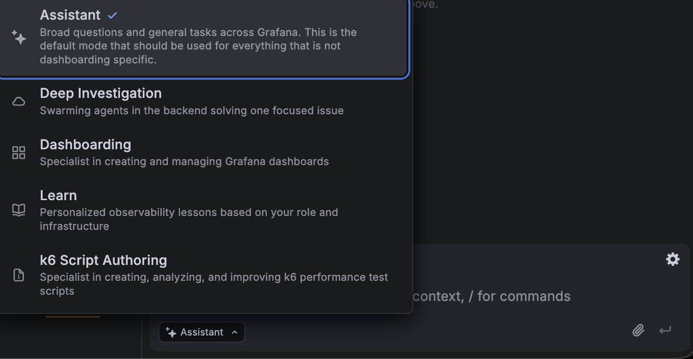

# Grafana Day — AI Assistant Workshop

> **60–90 minutes** · Hands-on · Bring your curiosity

---

## Welcome

We only have 60–90 minutes, so let's jump straight in.

**Your credentials are on the screen right now** — please double-check you're using your own, not your neighbour's.

This markdown is a suggested path, not a script. Everyone in the room brings different knowledge, so feel free to go off-road, challenge the Assistant in your own way, and break things on purpose. That's where the learning happens.

> **Golden rule of the day:** Treat the Assistant as a sparring partner, not a search engine. If the first answer is shallow, push back, rephrase, and add context.

---

## 1. (optional) Warm-up: Let the Assistant Teach You

Open **Grafana Assistant** and use the **"Learn"** feature to get your bearings.

### What to try

- Ask it for a guided tour of a feature you've never touched.
- Pick something slightly outside your comfort zone — alerting, SLOs, Drilldown, whatever you tend to avoid.
- Let it walk you through the product in-context, not just in text.

### Tips

- Be specific. _"Teach me how to build a Loki query for error rates in the last hour"_ beats _"teach me Loki"_.
- Don't accept the first answer — follow up with _"show me where that lives in the UI"_ or _"what would break if I did X?"_

---

## 2. Make It Yours: Behaviors and Skills

Time to customize the Assistant so it works the way you do.

### Create an Assistant Behavior (Rule)

> **Scope matters:** Behaviors (Rules) can be saved **just for you** or **everyone** — for that workshop please keep them **for you** to not interfere with your colleagues.

Think of Behaviors as personal house rules the Assistant always follows for _you_. Examples:

- _"Always answer in bullet points."_
- _"Assume I'm on the platform team."_
- _"Never suggest Classic dashboards, always Scenes."_

### Create a Skill

> Skills can be saved **globally**, so the whole organization benefits from what you build. Keep that in mind when you decide what goes where.

Skills are reusable capabilities that can be shared across the organization.

1. Head to the **Skills templates** — start from one that's close to what you want and adapt it.
2. **Save** the skill once.
3. **Set up a command.** This option only appears _after_ the first save, so don't go looking for it before then.
4. **Invoke the skill** from the chat window using your command.

Because skills are global, put a little extra care into naming, description, and edge cases — your colleagues will be using what you build.

### Tips

- Start with something small and useful. A skill that formats your team's runbook links consistently is already a win.
- Use Behaviors for taste and tone. Use Skills for repeatable work.
- Compare notes with your neighbour — different use cases will surface different ideas.

---

## 3. The Main Event: AI-Assisted Root Cause Analysis

This is the core exercise. We have a broken environment, and the Assistant is your investigation partner.

### Open the RCA Workbench

[**Open the RCA Workbench**](https://cabf76.grafana.net/a/grafana-asserts-app/assertions?start=1776817773301&end=1776825696565&we[0][n]=productcatalogservice&we[0][tp]=Service&we[0][sc][site]=us-east-2&we[0][sc][ns]=ditl-demo-prod&we[0][sc][env]=cabf76-cluster&we[1][n]=ditl-demo-prod&we[1][tp]=Namespace&we[1][sc][site]=us-east-2&we[1][sc][env]=cabf76-cluster&we[2][n]=flagd&we[2][tp]=Service&we[2][sc][site]=us-east-2&we[2][sc][ns]=ditl-demo-prod&we[2][sc][env]=cabf76-cluster&we[3][n]=productcatalog-postgres&we[3][tp]=Service&we[3][sc][site]=us-east-2&we[3][sc][ns]=ditl-demo-prod&we[3][sc][env]=cabf76-cluster&we[4][n]=checkoutservice&we[4][tp]=Service&we[4][sc][site]=us-east-2&we[4][sc][ns]=ditl-demo-prod&we[4][sc][env]=cabf76-cluster&we[5][n]=frontend&we[5][tp]=Service&we[5][sc][site]=us-east-2&we[5][sc][ns]=ditl-demo-prod&we[5][sc][env]=cabf76-cluster&we[6][n]=checkoutservice&we[6][tp]=Service&we[6][sc][site]=eu-west-1&we[6][sc][ns]=ditl-demo-prod&we[6][sc][env]=cabf76-cluster&we[7][n]=recommendationservice&we[7][tp]=Service&we[7][sc][site]=us-east-2&we[7][sc][ns]=ditl-demo-prod&we[7][sc][env]=cabf76-cluster&we[8][n]=frontendproxy&we[8][tp]=Service&we[8][sc][site]=us-east-2&we[8][sc][ns]=ditl-demo-prod&we[8][sc][env]=cabf76-cluster&we[9][n]=ditl-demo-frontend-client&we[9][tp]=Frontend&we[10][n]=checkoutservice&we[10][tp]=Service&we[10][sc][site]=ap-south-1&we[10][sc][ns]=ditl-demo-prod&we[10][sc][env]=cabf76-cluster&view=BY_ENTITY)

### Order of operations

1. **Kick off a Deep Investigation first.** It takes a while to run, so start it now and let it work in the background.
   - Tell the Assistant: _"Run a deep investigation for this incident."_
   - Or switch into **Deep Investigation mode** directly.
2. **While it runs**, use the Assistant as your sparring partner:
   - _"What services look most suspicious right now?"_
   - _"Walk me through the dependency chain of productcatalogservice."_
   - _"Which assertions fired first? Which look like noise?"_
   - Or directly: - _"What is the root cause?"_
3. **Come back to the Deep Investigation results** and compare them with your own hypothesis. Did your intuition match the Assistant's conclusion?

### Tips

- Time-box yourself to about 15 minutes before looking at the final conclusion. The investigation is where the learning happens.
- When you think you've found the root cause, prove it. Ask the Assistant for supporting evidence.

---

## 4. Zoom Out: What's Wrong With Your Environment?

Now ask the Assistant the broad, open-ended question:

> _"Is there anything wrong with my global environment at all?"_

### The challenge

- Does it actually find something, or is it vague?
- Can it give concrete recommendations to fix what it finds?
- Follow up: _"Rank these by impact,"_ _"Which of these can I fix without a deploy?"_, _"Write me a runbook for the top issue."_

### Tips

- Push for specificity. _"There might be high latency somewhere"_ is not useful. _"Checkout p95 is 4x normal in eu-west-1 since 14:02"_ is actionable.
- Ask it to self-check: _"How confident are you? What would prove you wrong?"_

---

## 5. Share the Experience

We'll spend the last **~20 minutes** going around the room.

- **Best win.** What did the Assistant nail?
- **Biggest surprise.** Where did it confidently get things wrong?
- **Best prompt you wrote.** Share it so others can steal it.
- **What would you build next** if you had a week with this?

---

### Wrap-up

You didn't just use an AI assistant today — you shaped one. Take your Behaviors and Skills with you. Happy troubleshooting.
